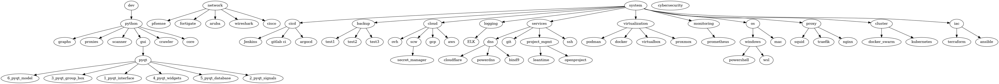

# doctum roadmap

## Description

A simple python script that render a graphical skill/course roadmap based on custom content [see roadmap_content](./roadmap_content/).

See the generated course roadmap below.

-----------------------------------------------------

## Usage

Graphical roadmap is automatically rendered using githubaction [see githubaction file](./.github/workflows/) Each time roadmap content is updated by push action.

## Sources :

- [Graphviz pip documentation](https://graphviz.readthedocs.io/en/stable/manual.html)